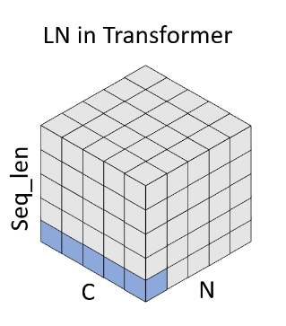
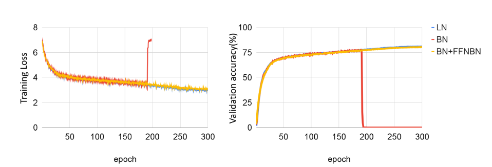
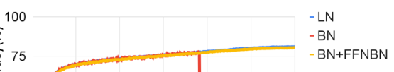

# Layer Normalization

Layer normalization is a feature normalization technique, similar to batch normalization, instance normalization, and group normalization. It emerged as an alternative to batch normalization, particularly for recurrent networks where the sequence length varies, making batch normalization non-trivial to apply. Consequently, layer normalization has become the de facto standard for normalization in such networks.

Normalization along the C or embedding axis leads to **2NHW statistical values** being calculated, specifically the mean and standard deviation. These statistics are computed during both training and inference phases, potentially making it slower than batch normalization, which fixes these statistics during training.

[PyTorch Documentation for LayerNorm](https://pytorch.org/docs/stable/generated/torch.nn.LayerNorm.html) explains that for transformers, layer normalization is applied over the embedding dimension.

A significant study in this domain is detailed in the paper ["Leveraging Batch Normalization for Vision Transformers"](paper-link). This paper explores the possibility of integrating batch normalization into Vision Transformers (ViT). It was found that replacing layer normalization with batch normalization could lead to crashes during training.

The authors suggest that this issue arises due to the absence of normalization layers in the subsequent FFN layers. They tested inserting a batch normalization layer between the two linear layers, which resolved the issue.

Their findings indicate that replacing layer normalization with batch normalization in ViTs yields almost equivalent performance, maintaining similar levels of effectiveness.

They note a 20% improvement in inference performance with batch normalization. However, this is arguably negligible for the architectures currently in development.

In conclusion, layer normalization is used in vision transformers as a legacy from text transformers, and **it has been demonstrated that both types of normalization can lead to comparable performance levels.**
